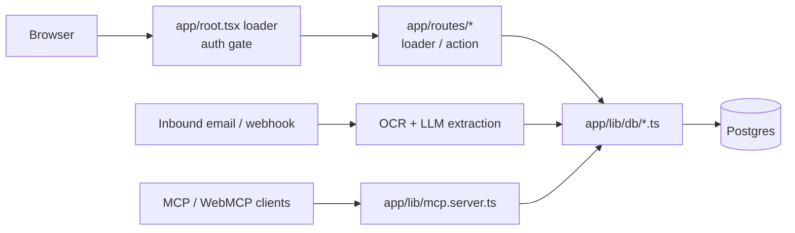

# Repository Guidelines

## Project Overview

Expense is a personal expense tracker for people filing taxes as individuals
(freelancers, self-employed, side hustlers). One app, one Postgres database, no
monorepo.

What it does:

- Captures **receipt** expenses (upload, paste, drag and drop, or a forwarded
  email) and **mileage** expenses (map a route, priced at the IRS rate for the
  drive date and type).
- OCR plus an LLM extract merchant, amount, and an IRS Schedule C category;
  every expense lands in a named **report**.
- Exports a PDF per report (receipts attached) or a ZIP (CSV plus images).
- Reconciles a bank statement against logged expenses to surface missed
  deductions.
- Speaks MCP at `/mcp` for AI assistants, registers read-only WebMCP tools in
  Chrome, and answers spending questions in-app on `/insights`.
- Publishes its marketing pages as the AI-search surface: `/llms.txt` and the
  `.md` mirrors are generated from one source file.

Accounts are multi-user: everything is scoped by `accountId`, users join an
account with an 8-character invite code, and accounts are fully isolated from
each other. Deployed to Vercel plus Supabase Postgres (us-west-2); a push to
`main` auto-deploys.

## Architecture & Data Flow

- **Framework**: React Router v8 framework mode, SSR. `app/routes.ts` is just
  `flatRoutes()`, so the URL tree comes from filenames in `app/routes/`:
  `_index.tsx` -> `/`, `expense.$id.tsx` -> `/expense/:id`, `[_]highlights.tsx`
  -> `/highlights`, and `[.]` is a literal dot (`mileage-rates[.]md.ts` ->
  `/mileage-rates.md`).
- **Route contract**: a route exports `loader`, `action`, `default` (component),
  `meta`, `headers`, `ErrorBoundary`. A route with `loader`/`action` but **no**
  `default` export is a **resource route** and returns `Response` directly
  (`api.*`, `oauth.*`, `.well-known.*`, `export.*[.]pdf|zip`, `mcp.ts`).
- **Auth gate is centralized** in the root loader (`app/root.tsx:65`): a
  hard-coded public set plus `PUBLIC_PAGES` (`/about`, `/ai`, `/connect`,
  `/faq`, `/mileage-rates`, `/schedule-c-categories`, `/alternatives`,
  `/llms.txt`). Everything else calls `requireUser(request)` and redirects to
  `/login?next=...`. The list is pinned by `test/public-paths.test.ts`; it strips
  `.data` and `.md` before matching, because client loader fetches append
  `.data`.
- **Resource routes bypass the root loader** and must self-gate: `requireUser`
  (`expense.$id.image.ts`, `api.webmcp.$resource.ts`), `assertCronSecret`
  (cron and dev routes), `SMOKE_TEST_SECRET` (`api.smoke.ts`), OAuth bearer
  inside `handleMcpRequest` (`/mcp`), and PKCE in `oauth.token.ts`.
- **All persistence goes through `app/lib/db/<domain>.ts`**, never from a route,
  over the Prisma 8 client exported as `db` from `app/lib/prisma.server.ts`.
  Three lanes: `db.orm.public.<Model>` (typed ORM), `db.sql.public.<table>`
  (SQL builder with `.outerLeftJoin` / `.select` / `.build()`, executed via
  `db.runtime().query(plan)`), and `db.transaction(fn)` (not `$transaction`).
- **`accountId` scoping is enforced in the db layer**, not the routes: every
  query filters by `accountId`, and updates match
  `and(id.eq(...), accountId.eq(...))`.
- **Prisma is contract-first**: `prisma/contract.prisma` is the source of truth;
  `prisma contract emit` writes `prisma/contract.json` + `contract.d.ts` (both
  committed). There is no runtime DDL and no `prisma migrate deploy`.
- **Images live in Postgres** (`image_blobs` BYTEA, dev and prod), stored under
  `images/{accountId}/YYYY-MM-DD_REPORT_FILE.ext`. No external object storage.
- **Ingest pipeline**: inbound email or webhook -> attachment, or the body
  rendered to an image -> OCR (tesseract, pdfjs) or LLM vision -> extraction
  cache -> expense row plus image blob. Idempotent on email id.

## Key Directories

| Path                 | Purpose                                                                       |
| -------------------- | ----------------------------------------------------------------------------- |
| `app/routes/`        | 58 route modules; file-based routing, loaders/actions live here               |
| `app/components/`    | React components; `app/components/ui/` holds the shared primitives            |
| `app/lib/`           | 87 modules: domain logic, server integrations (`*.server.ts`), data access    |
| `app/lib/db/`        | One module per domain (`expenses`, `reports`, `categories`, `accounts`, ...)  |
| `test/`              | 102 test files plus `helpers/` and `fixtures/`                                |
| `scripts/`           | Operational and one-off scripts (deploy, clone, check, smoke, redactors)      |
| `docs/`              | 15 reference docs; `docs/files.md` is the closest thing to an index           |
| `prisma/`            | `contract.prisma` (source of truth), emitted `contract.json`/`contract.d.ts`  |
| `migrations/`        | Contract snapshots, **not** `prisma/migrations/` (which is a v7-era leftover) |
| `public/`            | `robots.txt`, `sitemap.xml`, static images                                    |
| `patches/`           | `tesseract.js` wasm-core patch, asserted by `scripts/check`                   |
| `vendor/`            | `pdfkit-standard-fonts`, a tracer-bridge package for the Vercel build         |
| `.github/workflows/` | `deployment-checks.yml` (the CI gate), `publish-mcp.yml` (registry publish)   |

## Development Commands

| Command                                           | Runs                                                             | Notes                                                          |
| ------------------------------------------------- | ---------------------------------------------------------------- | -------------------------------------------------------------- |
| `pnpm dev`                                        | `portless run -- react-router dev`                               | Dev server behind `expense.localhost`                          |
| `pnpm build`                                      | `react-router build --force`                                     | `prebuild` runs `prisma contract emit` first                   |
| `pnpm start`                                      | `NODE_ENV=production react-router-serve ./build/server/index.js` | Serves the build on :3000                                      |
| `pnpm check`                                      | `./scripts/check`                                                | **Gate.** Static pipeline; rewrites files via `--fix`          |
| `pnpm test`                                       | `react-router build --force && vp test run`                      | **Gate.** Build then the full suite                            |
| `pnpm test:changed [ref]`                         | `vitest run --changed ${1:-HEAD}`                                | Fast lane over the static import graph                         |
| `pnpm test:related <file>`                        | `vitest related --run`                                           | Fast lane for tests importing the named files                  |
| `pnpm test:ocr`                                   | `RUN_OCR_TESTS=1 vpr test run test/pdf-ocr.test.ts ...`          | Real OCR round trip (script still says `vpr`; use `vp`)        |
| `pnpm test:db:push`                               | `bash scripts/reset-test-db`                                     | Drops and recreates `expense_test`                             |
| `pnpm db:push`                                    | `prisma db update`                                               | **Gate.** Syncs a DB to the contract (dev now, prod on deploy) |
| `pnpm db:migrate`                                 | `prisma db migrate`                                              | Applies planned migrations                                     |
| `pnpm build:prisma`                               | `prisma contract emit`                                           | Regenerates `contract.json` / `contract.d.ts`                  |
| `pnpm screenshot`                                 | `SCREENSHOT=1 vp test run test/screenshot.test.ts`               | Regenerates README screenshots                                 |
| `pnpm screenshots:review`                         | `tsx scripts/screenshots.ts`                                     | :3456 baseline-vs-new review UI                                |
| `pnpm setup:push` / `infer:rules` / `drain:email` | `tsx scripts/...`                                                | Fastmail push setup, email-rule inference, dev drain           |
| `./scripts/deploy`                                | check -> test -> prod db sync -> vercel -> smoke                 | The only production writer; `--skip-tests`, `--skip-db-sync`   |
| `./scripts/clone`                                 | prod dump -> local DB                                            | Read-only against prod; `LOCAL_DB_URL` overrides               |
| `./scripts/smoke-check <url>`                     | `GET /api/smoke`, fails unless `ok === true`                     | Shared by `scripts/deploy` and CI                              |

`pnpm check` runs, in order: `prisma contract emit` -> `react-router typegen` ->
`vp check --fix` (oxfmt + oxlint with type-aware tsgolint + `tsc`) ->
`node scripts/check-dark-mode.mjs` -> `secretlint` -> a tesseract patch probe ->
`knip`. Because step 3 auto-fixes, a nonzero exit means an unfixable lint or
type error. The same `vp check --fix` runs as a pre-commit hook.

## Code Conventions & Common Patterns

**Language and style.** TypeScript strict, `no any`, `verbatimModuleSyntax`.
`interfaces` over `type`, string unions over enums, no classes, early returns,
grouped imports, conventional commits. Path aliases: `~/*` -> `app/*`,
`~/test/*` -> `test/*`, `+types/*` -> `.react-router/types/*`. See
`docs/code-style.md`. Prose (comments, docs, commit messages) goes easy on em
dashes.

**Routes and mutations.** Loaders `throw redirect(...)`; actions `return
redirect(...)`. Mutations are FormData POSTs keyed by an `intent` string:
authenticated actions start with `const { user, form, intent } = await
requireIntent(request)`, anonymous ones with `parseIntent`. Expected failures are
returned as envelopes from `app/lib/validation.ts`: `badRequest(error)` (400),
`notFound()` (404), `unknownIntent()` (400). Loaders `throw notFound()`.
Unhandled errors bubble to the root `ErrorBoundary`. The client submits with
`useFetcher`; there is no client state library.

**Route types.** Run `react-router typegen` after adding or renaming a route,
then `import type { Route } from "./+types/<basename>"` and type against
`Route.LoaderArgs` / `Route.ActionArgs` / `Route.ComponentProps`.

**Server-only modules.** The `.server.ts` suffix marks a module that must never
enter the client bundle (about 40 under `app/lib/`). Do not import one from a
component. Non-`.server` modules that touch Node APIs need discipline, e.g.
`app/lib/env.ts` uses `process.loadEnvFile` and is only ever imported
server-side.

**Errors and logging.** Only `console.assert`, `.error`, `.info`, `.warn` are
allowed (`no-console` is a lint error, `console.log` is banned). Prefix messages
with a bracketed context tag (`[auth]`, `[mcp]`, `[inbound]`, `[email]`,
`[receipt-ocr]`, ...). Server-side reporting goes through `captureError` /
`captureWarning` / `captureErrorOnce` in `app/lib/errors.server.ts` (console
plus Sentry).

**Validation.** Hand-rolled helpers are the default for forms and domain rules
(`app/lib/validation.ts`, `app/lib/completeness.ts`). Zod is for tool contracts
and untrusted-wire boundaries only: MCP tool `inputSchema`, the isomorphic
read-tool schema converted with `z.toJSONSchema`
(`app/lib/expense-read-tools.ts`), and `safeParse` on every provider response
(JMAP, Gmail, Nominatim, OSRM).

**Timezone.** The server runs UTC; never compute a user-facing "today" in a
loader or action. `todayDate()` is client-only, and `useToday()` is null until
mounted. Timestamps render through `<LocalDate>` / `<LocalDateTime>`
(`app/components/ui/LocalTime.tsx`), which print ISO until mount. Prefer
`performance.now()` over `Date.now()` for deadlines.

**UI.** Tailwind v4 utilities, system-only dark mode, and **every color class
needs a `dark:` twin** (enforced by `scripts/check-dark-mode.mjs`). Use the
shared primitives in `app/components/ui/` (`Button`, `Input`, `Select`, `Card`,
`EmptyState`, `Alert`, `Badge`, `ConfirmDialog`, `DatePicker`, `Field`,
`Textarea`, `OrDivider`, `LocalTime`); style with `cva` plus `cn`. Design for
~320px first and widen at `sm:`. Icon-only controls need `aria-label`; controls
that back a keyboard shortcut need `data-shortcut="<kbar-action-id>"`.

**Database changes.** Edit `prisma/contract.prisma`, run `pnpm build:prisma`,
then `pnpm db:push` locally. DDL uses `DATABASE_URL_UNPOOLED` (session pooler);
runtime uses the transaction pooler with `max: 2`. Never raise the pool above
80% of `max_connections` (see the `(EMAXCONN)` incident in `docs/operations.md`).

**Heavy dependencies stay lazy.** `pdfkit`, `pdfjs-dist`, `tesseract.js`,
`@napi-rs/canvas`, `@resvg/resvg-js`, `puppeteer-core`/`@sparticuz/chromium`,
and the MCP SDK all load through dynamic `import()` inside the module that needs
them. Each has a shipping shim because Vercel's tracer cannot follow them: the
pdfjs worker global, the tesseract wasm-core patch, and the
`vendor/pdfkit-standard-fonts` package. Read
[`docs/operations.md`](docs/operations.md) before adding a heavy dependency.

**Cron routes.** Create `app/routes/api.<name>-cron.ts` and run the work through
`cronTick` (`app/lib/cron.server.ts`), which owns the Sentry `withMonitor`
wrapping and the explicit `Sentry.flush()` before returning. Guard inbound
webhooks with `assertCronSecret`. Never hand-roll a cron route.

**Adding an MCP tool.** Register it in `createMcpServer(accountId)` in
`app/lib/mcp.server.ts` with a zod `inputSchema`; reuse
`app/lib/expense-read.server.ts` and the write helpers rather than querying
directly.

**Feature highlights.** Every new user-facing feature or page ships with a "Did
you know?" card in `app/components/FeatureHighlight.tsx`, picked per request on
the home page; gate data-dependent ones in `availableHighlights` and pin the
gating in `test/highlights.test.ts`.

**Domain rules that bite.** `amount` is always the USD number every consumer
uses; `currency`, `originalAmount`, and `fxRate` on a receipt are provenance
only. Foreign receipts convert at the ECB reference rate for the expense date
(weekends roll back to the prior business day); the note is composed by
`app/lib/fx-note.ts` with strip-and-append, so re-saves replace it in place
instead of stacking copies, and the editor re-converts on a date change unless
the amount was hand-edited. Completeness is a display badge only (missing date,
amount, merchant, category, or report; the image does not count, and mileage
needs 2+ stops), never a save gate. Renaming a report updates expenses but not
stored image filenames until they are re-saved. Fastmail API tokens cannot
submit mail (403 on the submission scope), so connected-mailbox confirmations
are written to the owner's Inbox via `Email/import`; a valid token also proves
mailbox control, so onboarding stamps `emailVerifiedAt` without an emailed link.
Keep `prisma/backup.sql` (~300MB) out of Vercel uploads through the
`.vercelignore` `backup*.sql` entries.

**Marketing and LLM copy.** All public copy, JSON-LD, `/llms.txt`, and the `.md`
mirrors come from `app/lib/seo-content.ts`. Edit there, not in the route files.
Every link in `llms.txt` must also exist in `public/sitemap.xml`
(`test/llms-txt.test.ts`), and auth-gated pages must stay out of both.

## Important Files

| Path                                  | Role                                                                       |
| ------------------------------------- | -------------------------------------------------------------------------- |
| `app/routes.ts`                       | `flatRoutes()` manifest; the route tree is the filesystem                  |
| `app/root.tsx`                        | Root route: auth gate, theme script, `ErrorBoundary`, security headers     |
| `app/lib/prisma.server.ts`            | Prisma 8 client (`db`) over a `pg.Pool` with `max: 2`                      |
| `app/lib/db/expenses.ts`              | Representative data module: CRUD, image join, duplicate and neighbor reads |
| `app/lib/db/shared.ts`                | Row mappers, `cachedRead`/`bust`, test-mode helpers                        |
| `app/lib/auth.server.ts`              | `requireUser`, session cookie storage, login/signup, throttles             |
| `app/lib/route-helpers.server.ts`     | `requireIntent`, `parseIntent`, `assertCronSecret`                         |
| `app/lib/validation.ts`               | Form validators plus the `badRequest`/`notFound`/`unknownIntent` envelopes |
| `app/lib/errors.server.ts`            | `captureError` and friends (console + Sentry)                              |
| `app/lib/env.ts`                      | Env constants; server-only (reads `.env` via `process.loadEnvFile`)        |
| `app/lib/cron.server.ts`              | `cronTick`, the only supported cron wrapper                                |
| `app/lib/mcp.server.ts`               | MCP tool registry and OAuth `authenticateRequest`                          |
| `app/lib/seo-content.ts`              | Every string the public and AI-search surfaces render                      |
| `app/lib/images.server.ts`            | BYTEA image storage and `images/{accountId}/...` keys                      |
| `app/global.css`                      | Tailwind v4 entry: `@theme` tokens and the `.dark` variant                 |
| `prisma/contract.prisma`              | Schema source of truth; `prisma.config.ts` points the CLI here             |
| `vite.config.ts`                      | Build config plus the `fmt`/`lint` rules and the vitest project split      |
| `scripts/check`, `scripts/deploy`     | The gate and the production deploy path                                    |
| `test/helpers/globalSetup.ts`         | Once per run: recreate `expense_test`, seed, spawn the test server         |
| `test/helpers/launchBrowser.ts`       | Playwright browser plus signed-in context, hydration wait                  |
| `docs/files.md`, `docs/operations.md` | File map; env, pooler, Sentry, and incident history                        |

## Runtime/Tooling Preferences

- **Node >= 24** (`engines`), **pnpm 12.3.4** (`packageManager`, authoritative;
  CI reads it and installs the matching version). Bun is not used anywhere in
  this repo.
- **One toolchain: vite-plus.** `pnpm-workspace.yaml` catalogs `vite-plus`
  (binaries `vp`, `vpr`, `oxfmt`, `oxlint`) and aliases `vite` to
  `@voidzero-dev/vite-plus-core`. There is **no** eslint, prettier, tailwind,
  or postcss config file: the `fmt` and `lint` blocks in `vite.config.ts` are
  the config, with `printWidth: 80`, `singleQuote: false`, and semicolons.
- **TypeScript** is a single root `tsconfig.json`: `strict`, `noEmit`,
  `moduleResolution: bundler`, `jsx: react-jsx`, `target: ES2022`, with the
  aliases above re-declared as Vite `resolve.alias`.
- **Tailwind v4 is CSS-first** via the `@tailwindcss/vite` plugin. The theme
  lives in `app/global.css` (`@theme` tokens, `@custom-variant dark
(&:is(.dark *))`), not a JS config.
- **Postgres everywhere**, including images. Runtime connects through the
  Supabase transaction pooler (port 6543, `max: 2` per instance); DDL and the
  test reset use the unpooled/session URL.
- **Env contract**: `DATABASE_URL` is required at boot or the app crashes;
  `SESSION_SECRET` always; `APP_EMAIL`/`APP_PASSWORD` only until the first user
  exists. Names, by purpose: DB (`DATABASE_URL`, `DATABASE_URL_UNPOOLED`,
  `LOCAL_DB_URL`); auth (`APP_EMAIL`, `APP_PASSWORD`, `SESSION_SECRET`,
  `CRON_SECRET`, `PUBLIC_URL`, `SMOKE_TEST_SECRET`); email (`FASTMAIL_TOKEN`,
  `FASTMAIL_OAUTH_CLIENT_ID`, `INBOUND_EMAIL_ADDRESS`, `RECEIPTS_FOLDER`,
  `PUSH_PRIVATE_KEY`, `PUSH_AUTH`, `EMAIL_TOKEN_ENCRYPTION_KEY`); Google
  (`GOOGLE_OAUTH_CLIENT_ID`, `GOOGLE_OAUTH_CLIENT_SECRET`,
  `GOOGLE_PUBSUB_TOPIC`, `GOOGLE_PUBSUB_AUDIENCE`,
  `GOOGLE_PUSH_SERVICE_ACCOUNT`); LLM/OCR (`LLM_BASE_URL`, `LLM_API_KEY` (alias
  `DEEPSEEK_API_KEY`), `LLM_MODEL`, `LLM_VISION_MODEL`, `RECEIPT_OCR_MODE`);
  observability (`SENTRY_DSN`, `VITE_SENTRY_DSN`, `UMAMI_SCRIPT_URL`). `.env*`
  is gitignored; read [`docs/operations.md`](docs/operations.md) before touching
  any of them.

## Testing & QA

- **vitest v5** through `vp`, split into two projects from `vite.config.ts`:
  - `main` (`vitest.main.config.ts`): `test/**/*.test.ts(x)` minus an explicit
    exclude list. Real Postgres, a spawned app server, Playwright, and the email
    pipeline. `pool: "forks"`, one worker, `testTimeout: 30s`.
  - `unit` (`vitest.unit.config.ts`): an explicit 25-file list of pure-logic
    suites. `pool: "threads"`, parallel, no DB and no server.
  - `vitest.noglobal.config.ts` is an ad-hoc runner that skips the DB reset; it
    is deliberately outside `projects`.
- **Browser tests use the Playwright library, not `@playwright/test`.** There is
  no `playwright.config.*`. `test/helpers/launchBrowser.ts` shares one chromium
  and one signed-in context per file, and each file runs in its own fork.
- **A real Postgres is required.** Tests hardcode `expense_test` (passwordless
  user `assaf`), ignore the dev database, and recreate the schema from the
  contract on every run: `globalSetup` drops the public schema
  (`scripts/reset-test-db`), seeds, and spawns the built server on port 5199;
  `testSuiteSetup` reseeds per file. Start Postgres first
  (`brew services start postgresql@18`).
- **The clock is pinned** to `2026-07-15T12:00:00Z` across the test process, the
  browser page, and the server, ticking in real time. Use `performance.now()`
  for polling or deadlines. Never assert on wall-clock time.
- **Layout**: tests live in `test/`, never beside source, and mirror the module
  name (`app/lib/duplicates.ts` <-> `test/duplicates.test.ts`). Component tests
  use `.tsx`. Route-action unit tests type their args as
  `Parameters<typeof action>[0]` and import types relatively, because
  `~/routes/+types/...` does not resolve from `test/`.
- **Fixtures** live in `test/fixtures/` (emails, PDFs, images, bank statements)
  and are redacted with `scripts/redact-*.py`. Nothing in the suite may make a
  live network call: stub `fetch` and rely on the local mock JMAP server.
- **Hydration is the main flake source.** React Router remounts route components
  shortly after navigation, so wait for the fiber to attach
  (`waitForHydration`) or use `waitForEditorSettle(page)` before uploads.
- **Screenshots**: `test/screenshot.test.ts` compares against the committed
  `screenshots/` baselines (delta-E 2.3) and is skipped under `CI`. Review
  changes with `pnpm screenshots:review`.
- **Coverage is not configured.** No `coverage` block or thresholds exist in any
  vitest config; do not assume a coverage gate.
- **CI** is `.github/workflows/deployment-checks.yml`, in job order:
  `secretlint` -> `check` and `test` (postgres:18 service, `RUN_OCR_TESTS=1`) ->
  `migrate-db` (main only) -> `pdf-ocr-smoke`, which rolls the Vercel deployment
  back when the smoke check fails.

## Known Drift

Docs and comments reference several things that no longer exist. Verify against
the tree before acting on a doc:

- `scripts/migrate-prod`, `scripts/migrate-legacy`, `scripts/import-expensify.ts`,
  and `scripts/compress-images.ts` are cited in `docs/deploy.md`,
  `docs/operations.md`, `docs/accounts.md`, `docs/files.md`, and
  `app/lib/image-normalize.ts`, but none exist. The CI job runs
  `prisma db update` inline instead.
- `docs/mcp-demo.md` prescribes `pnpm demo:seed` / `pnpm demo:run`; neither
  alias exists.
- `docs/deploy.md` and `scripts/smoke-check` name
  `.github/workflows/deployment-smoke.yml`; the smoke job lives inside
  `deployment-checks.yml`.
- `vpr` and `vp` are used interchangeably in scripts and docs; the working
  binary is `vp` (`test:ocr` and `scripts/upgrade` still say `vpr`).
- `scripts/upgrade` auto-commits and runs `pnpm pnpm audit --prod` (a no-op
  typo). It contradicts the repo's never-commit-automatically rule; do not treat
  it as a template.
- `docs/testing.md` and `docs/deploy.md` describe the older `db push
--force-reset` flow; the reset now drops the schema and runs `prisma db init`.
