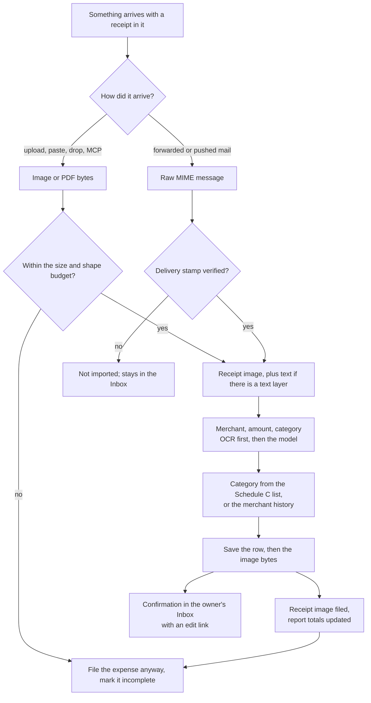
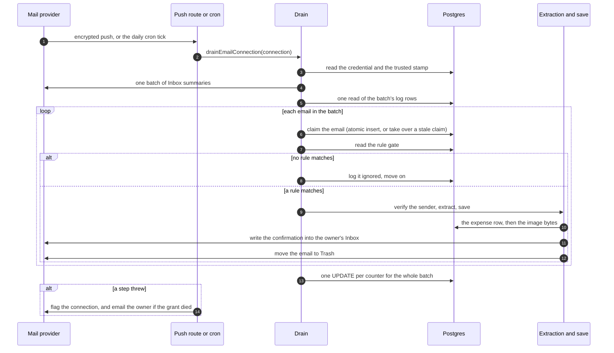
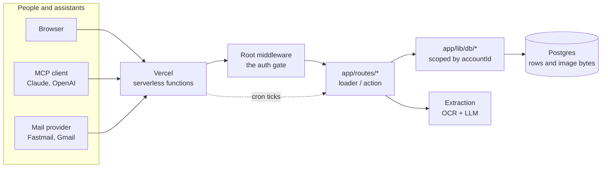
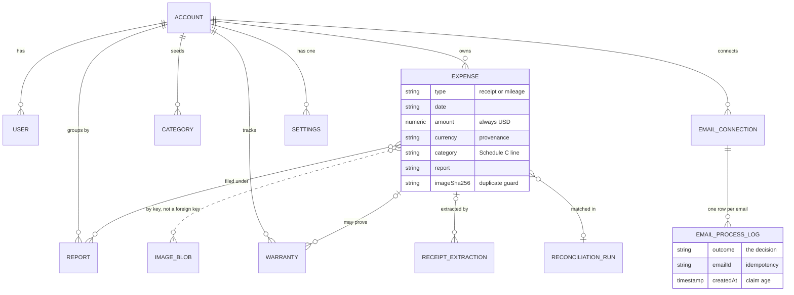
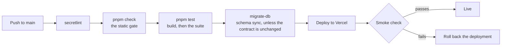

# Expense

Expense is a free expense tracker for people who file taxes as individuals:
freelancers, the self-employed, side hustlers, and the small teams around them.
A receipt goes in from a photo, a screenshot, a PDF, the clipboard, or the
mailbox itself; every expense lands under an IRS Schedule C category and in a
report you name; drives are priced at the IRS rate for the trip's date and
type; and the year leaves as a PDF per report or a ZIP with everything.

This document is the map: **what the product is, how it works, and how a person
uses it.** It is written to be read by a person deciding whether to use the app
and by a coding agent dropped into the repository with no other context.

| If you are                | Read                                                                                                               |
| ------------------------- | ------------------------------------------------------------------------------------------------------------------ |
| Evaluating the app        | [What it is](#what-it-is), [The tour](#the-tour)                                                                   |
| New to the codebase       | [How it is built](#how-it-is-built), [Where things live](#where-things-live)                                       |
| About to change something | [Conventions that bind a change](#conventions-that-bind-a-change), then [AGENTS.md](AGENTS.md)                     |
| Wiring an assistant to it | [AI assistants](#ai-assistants-mcp)                                                                                |
| Deploying or debugging it | [How a change reaches production](#how-a-change-reaches-production), then [docs/operations.md](docs/operations.md) |

Anything a user reads on the site lives in [`app/data/`](app/data) and nowhere
else; the canonical statement of price, positioning and feature claims is
[`app/data/product-facts.yaml`](app/data/product-facts.yaml), which renders the
public `/product-facts` page. This document does not restate those claims
independently, so the two can never disagree.

## What it is

A single-purpose web app for one job: keeping a defensible record of what a
person spent, in the shape a US Schedule C return needs.

- **Receipts and mileage are first-class, not an afterthought.** One expense is
  one row either way; a receipt carries an image, a drive carries stops and a
  distance. Both carry a date, an amount in USD, a category, and a report.
- **The category list is the tax form.** Every new account is seeded with all 22
  Schedule C Part II expense lines in the order the form lists them
  ([`app/data/default-categories.csv`](app/data/default-categories.csv)), so a
  year's totals line up with the return without re-bucketing.
- **Documents are the point.** The receipt image is stored, kept with the row,
  and named `YYYY-MM-DD_Report_Name.ext`. The export is a PDF your accountant
  can read, not a CSV they have to interpret.
- **Money is stored once.** `amount` is always the USD number every consumer
  uses; `currency`, `originalAmount` and `fxRate` are provenance only. A
  foreign receipt converts at the ECB reference rate for the expense date.
- **Free, with no card and no paid tier.** No ads, no resale, export and leave.
- **Not built for** corporate expense policies, approvals and reimbursements, or
  double-entry bookkeeping.

### Accounts and access

An account is the unit of isolation. Everything — expenses, reports, categories,
settings, images, connected mailboxes — belongs to one account and is invisible
to every other. An account has several users: you sign up and get one, or you
join an existing one with an 8-character invite code from Settings. Email is the
login name, hashed with scrypt; the session is a signed cookie. A connected
mailbox can create an account and have its address verified by the mailbox
login itself (the provider's token cannot send mail, so no email is involved).

## The tour

Every page a signed-in person can reach. Actions are the form posts each page
sends; all of them are intent-keyed and none of them mutate on a GET.

| Page                                                        | What it is for                                          | What you do there                                                                                                                       |
| ----------------------------------------------------------- | ------------------------------------------------------- | --------------------------------------------------------------------------------------------------------------------------------------- |
| `/expenses`                                                 | Home: this account's expenses, newest first             | Dismiss a suspected duplicate, delete (with a confirmation), drop a file anywhere on the page to add a receipt                          |
| `/expense/new`, `/expense/:id`                              | The receipt and mileage editors                         | Save, delete, add a report inline                                                                                                       |
| `/insights`                                                 | "Money checkup": ask about your spending in plain words | Ask a question, confirm a proposed expense or drive before it is filed, start a new conversation                                        |
| `/reconcile`                                                | Match a bank statement against what you logged          | Upload a statement, decide row by row which charge is which expense, complete the run                                                   |
| `/email-review`                                             | Receipt-like mail found in a connected inbox            | Process or ignore each item, optionally remember the sender                                                                             |
| `/emails`                                                   | Email settings                                          | Approve inbound senders, manage rules, connect or disconnect a mailbox                                                                  |
| `/warranties`, `/warranty/new`, `/warranty/:id`             | Warranty records, grouped by how soon coverage ends     | Drop in a warranty document and let it be read, edit the terms, remove a document                                                       |
| `/export`                                                   | Reports                                                 | Open and closed report groups, rename, close, download a PDF per report or one ZIP of everything                                        |
| `/settings`                                                 | Everything account-level                                | Categories, home address and saved locations, invite code, connected assistants, marketing email, email and password, close the account |
| `/login`, `/onboarding`, `/reset-password`, `/verify-email` | Getting in                                              | Sign in, create an account, join with a code, recover a password                                                                        |

The public side is the marketing surface, which doubles as the AI search
surface: `/`, `/about`, `/faq`, `/product-facts`, `/alternatives`, `/ai`,
`/connect`, `/mileage-rates`, `/schedule-c-categories`, `/support`, `/terms`,
`/privacy`, `/changelog`, plus a `.md` mirror of each and `/llms.txt`. That is
also how assistants find the app: see [docs/mcp.md](docs/mcp.md).

## How a receipt becomes an expense

The same pipeline serves every entrance — upload, paste, drag and drop, the MCP
tool, and both mail importers — so there is exactly one place where a receipt
becomes a row.

The decisions that matter, and why:

- **A known merchant skips the model.** If the text names a merchant the account
  has used before and a total that parses deterministically, the merchant,
  category and report come from that history and the amount is parsed, not
  guessed ([`app/lib/receipt-ai.server.ts`](app/lib/receipt-ai.server.ts)).
  Otherwise a hosted vision model reads the image; local tesseract OCR runs when
  the provider is unavailable or the mode is forced.
- **Completeness is a badge, not a gate.** A missing date, amount, merchant,
  category or report is shown as incomplete and the row still saves. A receipt
  the app cannot read is more useful filed-and-flagged than dropped.
- **The model is fenced.** Everything inside the receipt is data between
  `<<<RECEIPT>>>` markers, instructions in it are ignored, and every free-text
  field it returns is stripped of markers and length-bounded before storage.
- **Foreign receipts convert at the ECB rate for the expense date** (weekends
  roll back to the prior business day), the note is written once into the
  description, and changing the date re-converts unless the amount was
  hand-edited.
- **Nothing files twice.** An email is processed at most once, keyed on the
  provider's message id; the mail importers claim an email atomically before any
  work runs, and a claim older than ten minutes is taken over from a worker that
  died.

Depth: [docs/extraction.md](docs/extraction.md) for the extraction call and its
caps, [docs/receipts-by-email.md](docs/receipts-by-email.md) for the Fastmail
forwarding path.

## Connected mailboxes

Connect Fastmail or Gmail and receipts already sitting in the inbox import on
their own: merchant, amount and category filled in, nothing forwarded. Fastmail
support is native here, which most trackers do not offer.

The parts a reader should know:

- **The import is authenticated, not just pattern-matched.** A connected mailbox
  that cannot present a verified delivery stamp for the message does not import
  it. A rule match alone is not enough, which is what stops a forged `From` from
  injecting an expense.
- **A rule match is the trigger; the sender gate is the veto.** General rules
  (seeded) and per-account rules decide what is a receipt; a sender the account
  has not approved is answered with a note instead of imported.
- **Nothing is trashed on failure.** An error row stays in the Inbox and is
  offered on the review list, so a transient failure is recoverable by hand.
- **The counters are display numbers**, bumped once per batch rather than once
  per email.
- **A dead OAuth grant gets a human.** The failure is recognised through the
  error chain, so the owner is emailed to reconnect instead of silently
  retrying forever.

Depth: [docs/email-connections.md](docs/email-connections.md).

## Mileage

A drive is a list of stops, not a distance to type. Map it; the app geocodes
each stop (Nominatim), routes it (OSRM), and prices it at the IRS rate for the
trip's date and type. One way by default, home → stops → home when it is a loop.
No API keys: OpenStreetMap services only, rate limited, with a straight-line
fallback marked _approx._ when routing is unavailable. Trip stops are capped at
12 so one request cannot fan out into an unbounded number of geocoding calls.

## Reports, categories and exports

A **report** is a named bucket for a tax period or project ("Q3 2026"). Reports
hold both receipt and mileage expenses. A closed report leaves the list and the
editor, its expenses open read-only with no Save, and a save that targets one is
rejected — until it is reopened.

**Categories** are the Schedule C lines, seeded per account and renameable.

Two exports, both built on demand:

- **A PDF per report**, grouped by category, with every receipt image attached
  and an appendix that draws the route map for each drive.
- **One ZIP of everything**: the expense CSV, every image under the same
  `YYYY-MM-DD_Report_FILE.ext` names, and the mileage rate table used.

## Reconciliation

Upload a statement (CSV, PDF, QFX/OFX, or Excel) and the app matches its charges
against the expenses already logged, so the gap is visible: charges with no
receipt, receipts with no charge. Nothing is written until you say so — each row
is your decision, the run records them, and completing it links the pairs in one
transaction. Credits and refunds are never auto-matched, and a receipt is never
matched to two charges.

Depth: [docs/reconciliation.md](docs/reconciliation.md).

## Warranties

Drop a warranty document (or the receipt) on the warranties page. The document is
read for merchant, product, purchase date and expiry; the file stays attached;
the record can be linked to the expense it came from. The list groups by what is
still in force, expiring within 90 days, already expired, or with no end date.
A warranty is its own record: it can outlive the tax year or cover something
that was never deductible, so it never appears in an expense list or a report.

## Insights

Ask about your spending in plain words. The answer streams back with a chart,
computed from your own expenses, and can propose an expense or a drive for you
to confirm with one click — the model never files anything itself.

What the model may do is deliberately small: query expenses within the period the
app computed, and propose a trip or an expense from what you said. What it may
not do is invent a number, pick a category or report that is not in your lists,
guess a mileage address, or treat anything inside the data fences as an
instruction. Rounds, tool calls, argument lengths and stream size are all capped;
when a cap is hit the answer still completes with what it has.

## AI assistants (MCP)

The app speaks the Model Context Protocol at `https://expense.labnotes.org/mcp`.
An assistant connects with OAuth — you sign in and click Allow — so there are no
API keys and no separate assistant account. The design rule is _capabilities, not
CRUD_: the tools do what a person would do.

| Tool                                                                                                    | What it does                                                                       |
| ------------------------------------------------------------------------------------------------------- | ---------------------------------------------------------------------------------- |
| `capture_receipt`                                                                                       | Take an image or PDF, run the same extraction as the web app, file the expense     |
| `log_mileage`                                                                                           | Take stops in plain English, geocode, route, price at the IRS rate, file the drive |
| `list_expenses`, `expense_summary`, `list_reports`, `list_categories`, `list_merchants`, `get_settings` | Read the account's own data                                                        |
| `create_report`, `close_report`, `add_to_report`, `export_report`                                       | Group and export                                                                   |
| `reconcile`                                                                                             | Match a statement against logged expenses, read-only                               |

A tool may never see another account's rows, and the answer to a spending
question comes from a query over your data rather than from the model's memory.
Chrome can also register read-only WebMCP tools directly against the page.

Depth: [docs/mcp.md](docs/mcp.md), and [app/data/ai.yaml](app/data/ai.yaml) for the
user-facing copy.

## How it is built

The decisions that shape everything else:

- **The URL tree is the filesystem.** `app/routes.ts` is a `flatRoutes()` call, so
  a file's name is its URL: `expense.$id.tsx` is `/expense/:id`, and `[.]` is a
  literal dot (`mileage-rates[.]md.ts` is `/mileage-rates.md`).
- **Authentication is middleware, not per page.** The root route resolves the
  session once and publishes the user; a route reads it with
  `requireContextUser`. A public path is a named list, and a resource route that
  carries its own credential must be listed as self-gating or the gate bounces
  it to `/login` before it can answer.
- **All persistence goes through `app/lib/db/`.** Routes never query the
  database, and every query there is scoped by `accountId` — including updates,
  which match the id _and_ the account.
- **Images are rows.** Receipt images live in Postgres as bytes, keyed
  `images/{accountId}/...`. There is no object storage, and two accounts cannot
  collide because the key carries the account.
- **One expense table, two shapes.** `_type` ("receipt" or "mileage")
  discriminates: an image and a merchant on one side, stops, distance and rate
  on the other. Mileage is not a parallel schema.
- **The schema is a contract, not migrations.** `prisma/contract.prisma` is the
  source of truth; `pnpm build:prisma` emits the artifacts the runtime reads and
  the database is brought in line with `db push`. There is no migrate-deploy
  step and no runtime DDL.
- **Heavy work loads lazily.** OCR, PDF, canvas and the MCP SDK load through
  dynamic import with shipping shims, so a cold function start stays cheap.

The row-level invariants that the rest of the app leans on: an expense's
`amount` is USD and everything else is provenance; `accountId` is on every table
that holds a person's data; `EmailProcessLog` has one row per
(connection, email) and its `outcome` is the decision record the drain, the
review list and the counters all read.

## How a change reaches production

A push to `main` is a deploy, so CI is the gate: the static pipeline and the
full suite both have to pass, the schema sync runs only when the contract
changed, and a failed smoke check rolls the deployment back on its own.
`./scripts/deploy` is the only other production writer. Depth:
[docs/deploy.md](docs/deploy.md), [docs/operations.md](docs/operations.md).

## Where things live

| Path                 | What is in it                                                                                                                                     |
| -------------------- | ------------------------------------------------------------------------------------------------------------------------------------------------- |
| `app/routes/`        | 83 route modules. Every file is a URL. Loaders and actions live here; a module with no default export is a resource route that returns a Response |
| `app/lib/`           | 107 modules of domain logic; 67 of them are `*.server.ts` and must never reach the client bundle                                                  |
| `app/lib/db/`        | 22 modules, one per domain. Every query in the app is written here, scoped by `accountId`                                                         |
| `app/components/`    | 21 components; `ui/` holds the 19 shared primitives every screen is built from                                                                    |
| `app/data/`          | All public copy, one file per page, plus the CSV/YAML seeds (categories, email rules, mileage rates, warranty policies) and the changelog         |
| `prisma/`            | `contract.prisma` and the emitted `contract.json` / `contract.d.ts`                                                                               |
| `test/`              | 144 suites over the real database and a spawned server                                                                                            |
| `docs/`              | The reference set, indexed by [docs/files.md](docs/files.md)                                                                                      |
| `scripts/`           | Operational scripts and the gate (`scripts/check`)                                                                                                |
| `.github/workflows/` | The CI pipeline that deploys                                                                                                                      |

## Conventions that bind a change

The short list, because the long one is not negotiable:

- **Write to `app/lib/db/`.** Never query from a route or a lib module. Scope
  every query by `accountId`, updates included.
- **Never import a `.server.ts` module into a component.**
- **A schema change is:** edit `prisma/contract.prisma`, `pnpm build:prisma`,
  `pnpm db:push`. No migration files.
- **Every color class needs its `dark:` twin**, enforced by a check.
- **Every user-facing change gets a line in `app/data/changelog.yaml`** as part
  of the same change.
- **New public copy goes in `app/data/`**, not inline in a route or component.
- **Tests live in `test/`** and mirror the module they cover. A behavioral fix
  ships with a test that fails without it.

The full set, with the reasoning and the traps, is
[AGENTS.md](AGENTS.md) — read it before changing anything here.

## Vocabulary

Terms that mean something specific in this codebase:

| Term                            | Meaning                                                                                                                            |
| ------------------------------- | ---------------------------------------------------------------------------------------------------------------------------------- |
| **Report**                      | A named bucket of expenses for a tax period or project. Closing one freezes it                                                     |
| **Schedule C category**         | One of the seeded IRS Part II expense lines. The category list _is_ the tax form                                                   |
| **Completeness**                | A display badge for a missing date, amount, merchant, category or report. Never a save gate                                        |
| **Claim**                       | The atomic write that marks an email as being processed, inserted before any work runs. The duplicate-expense guard                |
| **Settled**                     | An email already decided, or claimed by a live worker. The drain's batched read of this is what keeps the inbox from re-processing |
| **Stale claim**                 | A claim older than ten minutes: its worker died, so another drain may take it over                                                 |
| **Outcome**                     | The decision recorded per email in the process log: created, partial, ignored, error, and the review states                        |
| **Delivery stamp / auth chain** | The provider's authentication verdict on a message. A connected mailbox imports only what passes it                                |
| **Superseded**                  | A bank notification a covering receipt has replaced. The mail stays; the skip is recorded                                          |
| **FX note**                     | The provenance line appended to a converted expense's description, replaced in place on re-save                                    |
| **Mileage type**                | The IRS classification that picks the rate: business, medical, charitable, or personal                                             |

## Reference

| Document                                               | What is in it                                             |
| ------------------------------------------------------ | --------------------------------------------------------- |
| [docs/files.md](docs/files.md)                         | Every notable file, one line each                         |
| [docs/code-style.md](docs/code-style.md)               | TypeScript and React conventions                          |
| [docs/testing.md](docs/testing.md)                     | How the suite runs, the pinned clock, the browser gotchas |
| [docs/operations.md](docs/operations.md)               | Env vars, poolers, secrets, incident history              |
| [docs/deploy.md](docs/deploy.md)                       | Deploy ordering and the smoke checks                      |
| [docs/extraction.md](docs/extraction.md)               | The LLM extraction pipeline and its caps                  |
| [docs/receipts-by-email.md](docs/receipts-by-email.md) | The Fastmail forwarding path end to end                   |
| [docs/email-connections.md](docs/email-connections.md) | Connected mailboxes, the drain, review                    |
| [docs/reconciliation.md](docs/reconciliation.md)       | Statement matching                                        |
| [docs/accounts.md](docs/accounts.md)                   | Accounts, users, invites                                  |
| [docs/mcp.md](docs/mcp.md)                             | The assistant-facing reference                            |
| [docs/dark-mode.md](docs/dark-mode.md)                 | Theme rules                                               |
| [AGENTS.md](AGENTS.md)                                 | The invariants, commands and traps that bind a change     |
