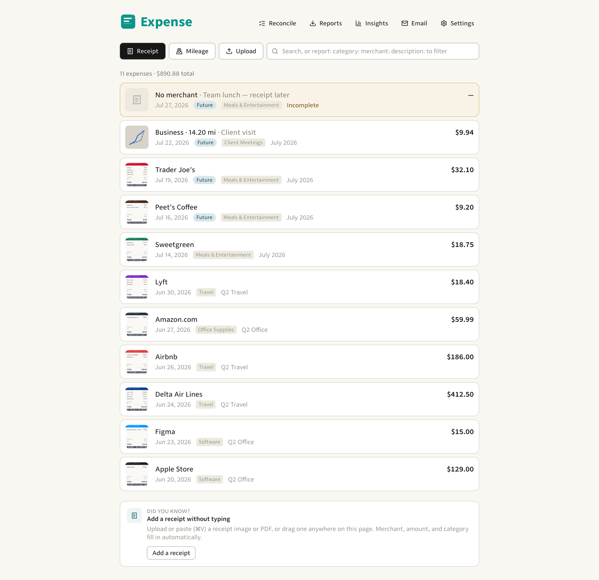
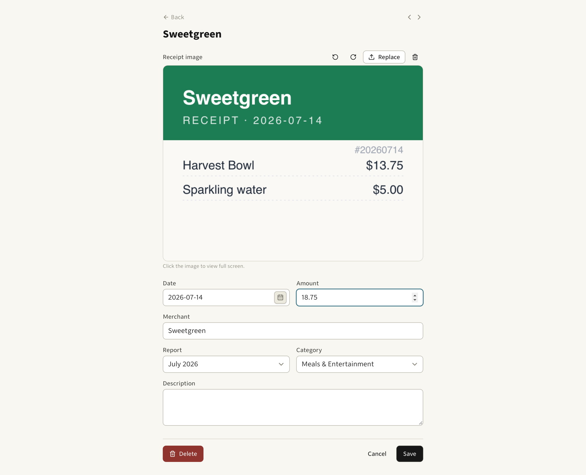

# Expense

Personal expense tracking with receipts and mileage.

## Screenshots





What it does:

- Log expenses two ways: receipt-based (upload/scan an image, add date, report,
  category, merchant, amount) and mileage (drive route on a map — Leaflet + OSRM
  — with configurable per-year mileage rates)
- **Receipts by email**: forward a receipt to your inbox address and it's
  parsed (merchant/amount/category) and added automatically — see below
- Organize into reports and categories; every receipt image is stored and
  auto-renamed to a convention (YYYY-MM-DD_Report_Name.jpg)
- Export: PDF per report (with embedded receipt images) and a ZIP of everything
- Settings: reports, categories, mileage rates, home location for mileage routes

Stack:

- React Router v8 (framework mode) + Tailwind v4, TypeScript
- Postgres via Prisma — accounts, users, expenses, reports, categories,
  settings, mileage, image blobs
- Images: Postgres BYTEA (prod and dev/test) — no external store
- Deployed on Vercel + Neon (git push to main auto-deploys)

Auth & accounts (the recent work):

- Email/password login (scrypt-hashed), sessions via signed cookies
- Multi-user accounts: each account has its own data, users in the same account
  share everything, other accounts fully isolated
- New users join an account via an 8-char invite code (shown in Settings,
  regenerable); anyone can self-signup into a fresh account
- Image keys are namespaced per account so two accounts can never collide

## Accounts & sharing

Login is email/password (scrypt-hashed) — the email is the login name, stored
lowercase and unique, format-validated at signup/join. Every expense, report,
category, and setting belongs to an **account**; everyone in an account shares
them, and accounts are fully isolated from each other.

- **Sign up** → creates a brand-new account (starts empty).
- **Join** → enter an account's invite code (Settings → Account) to share
  that account's data.
- The first account/user is bootstrapped from `APP_EMAIL`/`APP_PASSWORD`
  when the database is empty; pre-email accounts get their login backfilled
  from `APP_EMAIL` on first start (initStore).

## SEO & AI discovery

The public marketing pages double as the site's AI-search surface: when
someone asks an assistant for a free expense tracker, GPTBot / OAI-SearchBot /
ClaudeBot / PerplexityBot crawl and quote them. The copy is written as
standalone, quotable answers that name the app and its URL, and it lives in
ONE place — `app/lib/seo-content.ts` — which renders every surface:

| Page                                     | Purpose                                                        |
| ---------------------------------------- | -------------------------------------------------------------- |
| `/`                                      | Landing page (SoftwareApplication JSON-LD)                     |
| `/about`                                 | Full feature/benefit list (AboutPage JSON-LD)                  |
| `/faq`                                   | 13 Q&As matching real AI queries (FAQPage JSON-LD)             |
| `/alternatives`                          | Expense vs Expensify comparison (WebPage + FAQPage JSON-LD)    |
| `/llms.txt`                              | The llmstxt.org file — the curated overview AI assistants read |
| `/about.md` `/faq.md` `/alternatives.md` | Markdown mirrors per the llms.txt convention                   |

Supporting plumbing: `public/robots.txt` explicitly allows the AI crawlers
(GPTBot, OAI-SearchBot, ChatGPT-User, ClaudeBot / Claude-SearchBot /
Claude-User, PerplexityBot / Perplexity-User, Google-Extended,
Applebot-Extended, meta-externalagent) while app routes stay blocked, and
`public/sitemap.xml` lists the public pages.

These routes are public (see the root loader in `app/root.tsx`); everything
else still requires a session.

## What it does

- Track **receipt** expenses (date, merchant, amount, image, category, report)
  and **mileage** expenses (date, 2+ addresses, distance, amount, report).
- Mileage routes run **Home → stops → Home**; distance is computed via OSRM and
  the amount from a per-year mileage rate. Maps use Leaflet + OpenStreetMap —
  **no API keys required**.
- Incomplete expenses are highlighted so they're easy to finish.
- Paste (⌘V) or upload an image anywhere to start a new receipt.
- **Export**: each report as a PDF (grouped by category, with all receipt
  images), or everything as a ZIP (CSV + images named `YYYY-MM-DD_REPORT_FILE.ext`).

## State

Storage is Postgres-only via **Prisma** (`prisma/schema.prisma` is the
single schema source of truth; the client is generated to
`prisma/generated` by `pnpm build:prisma`). `DATABASE_URL` is required at
startup (the app exits with a clear error otherwise). Receipt images live in
Postgres BYTEA (`image_blobs`) in prod and dev — no separate storage service.

| Data                        | Images                         |
| --------------------------- | ------------------------------ |
| `accounts` / `users` /      | Postgres BYTEA (`image_blobs`, |
| `expenses` / `reports` /    | prod and dev)                  |
| `categories` / `settings` / |                                |
| `mileage` / `image_blobs`   |                                |

All reads/writes go through `app/lib/store.server.ts` (→
`app/lib/database.ts`, Prisma queries scoped by `accountId`); image storage
is behind `app/lib/images.server.ts` (Prisma `imageBlob`).
Keys are `images/{accountId}/...` pathnames on every backend — namespaced
per account so two accounts can never collide on the same filename.
Schema changes: edit `prisma/schema.prisma`, then `prisma migrate dev --name …` locally and
`pnpm db:push` (or `pnpm db:migrate`) before deploying.

### `data/` — removed

The file-era migration source (`data/*.csv` + `data/images/*` and the
`pnpm migrate-data` one-off) was deleted in the Jul 2026 cleanup — data now
lives in the database, and importing from Expensify happens via
`scripts/import-expensify.ts`. Cloning prod uses `scripts/clone`
(`prisma/backup.sql`).

## Quick start

## Environment variables

Load order: real `process.env` (Vercel dashboard, or inline) wins; a local
`.env` file fills the gaps. `DATABASE_URL` is required; `.env` is gitignored. if
(!hasDatabase()) {

**dev / test — local `.env`:**

```bash
# .env (project root, gitignored)
DATABASE_URL=postgres://assaf@localhost/expense_dev   # include the local user
SESSION_SECRET=…         # signs the session cookie (random hex)
APP_EMAIL=…           # bootstrap: first account's email (empty DB only)
APP_PASSWORD=…           # bootstrap: first account's password (empty DB only)
# Receipts by email (all optional):
# RESEND_API_KEY=re_…            INBOUND_EMAIL_WEBHOOK_SECRET=whsec_…
# INBOUND_EMAIL_ADDRESS=receipts@example.com   # forwarding + reply sender
# DEEPSEEK_API_KEY=sk-…          RECEIPT_OCR_MODE=auto
```

On an empty database the first account + user are bootstrapped from
`APP_EMAIL`/`APP_PASSWORD` (fail-closed if missing); afterwards users are
created through the app's signup/join flow. `SESSION_SECRET` is always
required. `APP_EMAIL`/`APP_PASSWORD` can be removed from `.env` once you
have at least one user.

Accounts created before email login (username era) keep their old username
as the stored email until `APP_EMAIL` is set — `initStore` then backfills
that address onto the bootstrap (oldest) user, so the configured credentials
keep working.

Tests intentionally hardcode `expense_test` (Postgres incl. image blobs),
ignore the local database, and reset the schema from Prisma on each run
(`pnpm test:db:push` in the test setup).

**prod — Vercel:** set env vars in the project dashboard (Settings →
Environment Variables): `DATABASE_URL` (Vercel Postgres / Neon pooled URL),
`SESSION_SECRET`,
and (only until the first user exists) `APP_EMAIL` / `APP_PASSWORD`.
Vercel injects them at runtime; `.env` never exists there.

## Receipts by email

Forward a receipt email to your inbox address and it's parsed and added
automatically: the merchant, amount, and category are extracted, the receipt
is stored as an image, and the expense date is the date of the email being
forwarded. If something can't be processed, a reply email explains what
happened.

How it decides what to import:

- Receipt **attached as PDF/image** → that attachment becomes the receipt
  image; text is extracted from the PDF text layer (or OCR'd) to get the
  merchant/amount/category.
- Receipt **inline in the email** (ASCII/HTML) → the email body is turned
  into an image and stored; the text is parsed the same way.
- Multiple attachments (e.g. a receipt + a logo or signature) → only the
  actual receipt is handled (heuristics + model tiebreak).
- The sender must be on the account's **allowed sender list** (Settings →
  Receipts by email); anything else gets a "sender not recognized" reply.
  You can add several addresses. If the same address is allowed by multiple
  accounts, the account that added it first claims it — removing it there
  falls through to the next account that allows it.
- Successful imports don't email you; incomplete ones (missing merchant,
  amount, …) create the expense anyway and reply listing what's missing.
- Each email is processed at most once (idempotent per email id).

### Setup (Resend + DeepSeek)

Vercel has no inbound email, so receipt emails are received by **Resend**
(receiving = parse email → POST webhook) and parsed by **DeepSeek**
(`deepseek-v4-flash`). Replies on failure go out through Resend too.

1. Create a [Resend](https://resend.com) account and add a domain (e.g.
   `labnotes.org`) — you'll point MX/DKIM/SPF DNS records at Resend.
2. Resend → **Receiving**: add a receiving domain and an inbound route
   (catch-all or `receipts@…`) that POSTs to
   `https://<your-app>/api/inbound-email`.
3. On the webhook, copy the **signing secret** (`whsec_…`).
4. Create a [DeepSeek](https://platform.deepseek.com) API key.
5. Set env vars (dev `.env`, prod Vercel dashboard):

   ```bash
   RESEND_API_KEY=re_…                     # receive + send replies
   INBOUND_EMAIL_WEBHOOK_SECRET=whsec_…    # verifies the webhook signature
   INBOUND_EMAIL_ADDRESS=receipts@labnotes.org  # forwarding address + reply sender
   DEEPSEEK_API_KEY=sk-…                   # receipt text/OCR extraction
   DEEPSEEK_MODEL=deepseek-v4-flash        # optional, this is the default
   RECEIPT_OCR_MODE=auto                   # auto|deepseek|tesseract (default auto)
   ```

   All are optional — without them the webhook returns 503 and receipts
   aren't imported.

6. In the app: Settings → **Receipts by email** → add each address you'll
   forward from (you can add several), then forward a receipt to your
   inbound address.

Notes:

- **DeepSeek vision**: the hosted DeepSeek API is text-only today — image
  receipts are OCR'd locally with tesseract.js (worker/fonts fetched from a
  CDN at runtime). Set `RECEIPT_OCR_MODE=deepseek` if/when the hosted model
  accepts images (it tries vision first and falls back automatically on
  `auto`).
- **Scanned PDFs** (no text layer) are rasterized and OCR'd; the first pages
  become the stored receipt image.
- **HTML receipts** are stored as a rendered text image (monospace receipt
  sheet) — no headless browser needed.
- Forwarding **as attachment (.eml)** — the receipt nested inside the .eml is
  not unpacked; use normal inline forwarding (Gmail/iOS quote the original in
  the body).
- Webhook processing runs up to 60s (Vercel `maxDuration`) — enough for
  attachment download + OCR + extraction.

## Quick start

Prerequisites: Postgres running locally (`brew services start postgresql@18`).

```bash
createdb expense_dev          # once
pnpm install
# create .env with the local values above
pnpm db:push                    # create the schema from prisma/schema.prisma
pnpm dev                        # reads .env
```

Running the server without `DATABASE_URL` exits immediately with a clear
error — there is no file-based fallback.

```bash
pnpm check        # prisma generate + typegen + format + lint + typecheck
pnpm build        # production build (build:prisma runs first)
pnpm start        # serve the production build (port 3000)
pnpm test         # resets expense_test from Prisma and runs the suite
```

Node 24+ and pnpm 11+ (developed/tested on Node 26).

## Deployment

**Vercel (recommended):** the app deploys with Vercel's zero-config React
Router support — no preset needed. (`@vercel/react-router`'s `vercelPreset()`
is still pinned to React Router v7 as of this writing — track
[vercel/vercel#16730](https://github.com/vercel/vercel/issues/16730); the
zero-config path builds one SSR function that serves every route.)

1. Push to GitHub (already configured: `origin` → `assaf/expense`).
2. In Vercel: **Add New → Project → Import `assaf/expense`**. Framework is
   auto-detected as React Router; `vercel.json` pins the build command.
3. Set env vars in the project (Settings → Environment Variables):
   - `DATABASE_URL` — Vercel Postgres / Neon pooled URL. Tables are created
     automatically on first request.
   - Node 24+ (`engines`; the project runs on Node 26); pick Node 26 in
     project settings if Vercel doesn't match automatically.
4. One-time data import is done — the CSV source under `data/` was deleted
   in the Jul 2026 cleanup (data verified in the database: 306 expenses,
   247 images). Import from Expensify now goes through
   `scripts/import-expensify.ts`; cloning prod locally uses `scripts/clone`.

5. Deploy. Test the app is behind Deployment Protection or basic auth — the
   app has no built-in login (single-user personal tool).

```bash
./scripts/deploy            # check + tests + deploy
./scripts/deploy --skip-tests
```

Vercel has its own environment management (dashboard) — set `DATABASE_URL`
there directly (all images are stored in the database, so no other storage
env is needed).

## Maps & geocoding

Uses free OpenStreetMap services (Nominatim for geocoding, OSRM for routing,
OSM raster tiles for the map). Rate-limited but fine for personal use. If OSRM
is unavailable, distance falls back to straight-line (marked "approx.").
