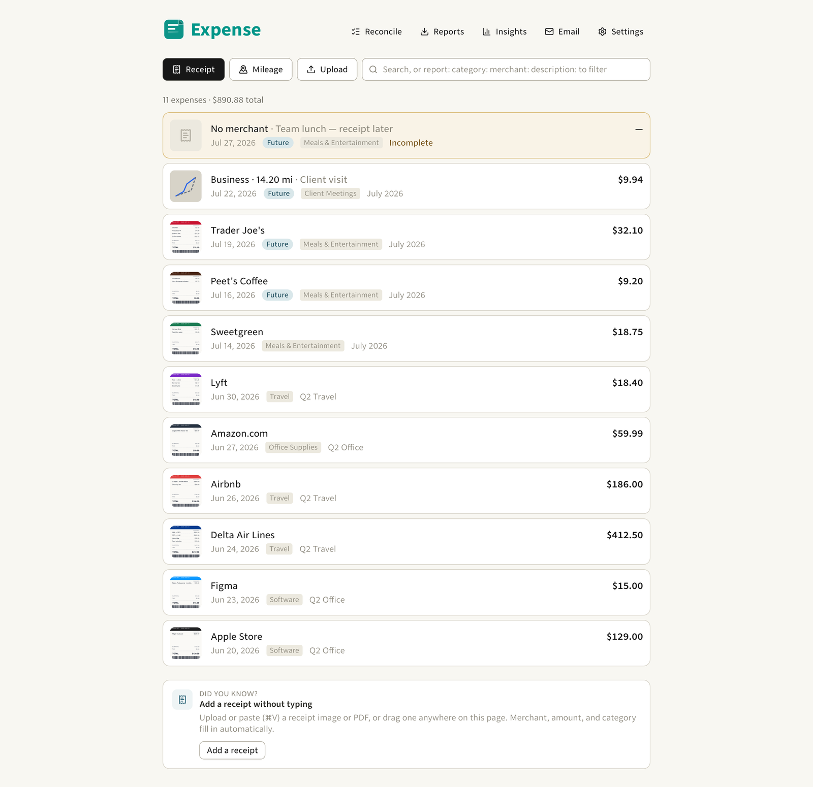
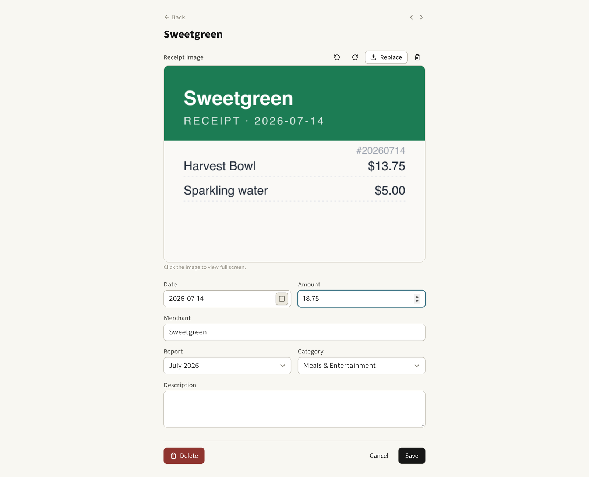
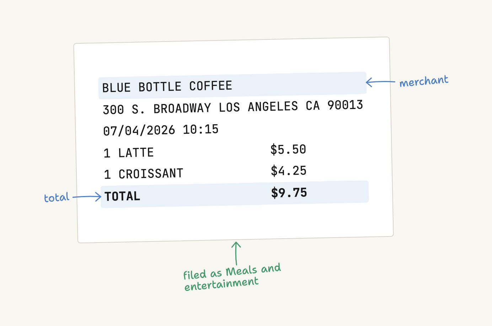

# Expense

> Expense is a seamless receipt tracking solution: receipts are automatically
> sent via email, mileage uses the tax rate provided by the IRS, and a smart AI
> assistant does your data entry so that you can forget about the process
> altogether.

**[PRODUCT.md](PRODUCT.md) is the map**: what the product is, how it works, the
pages a person uses, the architecture and data model, and the vocabulary. This
file is the front door; that one is the orientation.

## Screenshots







## What it does

Receipts come in from a photo, a screenshot, a PDF, the clipboard, a connected
Fastmail or Gmail mailbox, or an MCP assistant; each one is read for merchant,
amount and category, filed under an IRS Schedule C line, and kept with its image.
Drives are mapped and priced at the IRS rate for the trip date and type. The year
leaves as a PDF per report, with the receipts attached, or as one ZIP of
everything. A warranty document dropped on the warranties page becomes a record
you can find by how soon coverage ends.

Free, no card, no ads, no paid tier. Not built for corporate expense policy,
approvals, or double-entry bookkeeping. The full tour, with the pages and the
rules behind each one, is in [PRODUCT.md](PRODUCT.md).

## AI assistants (MCP)

The app speaks the Model Context Protocol at `https://expense.labnotes.org/mcp`.
An assistant connects with OAuth — you sign in and click Allow — so there are no
API keys. A connected assistant can capture a receipt, log a drive, answer
questions about your spending, manage reports, and match a bank statement.

```json
// Claude — .mcp.json (no headers needed: the client discovers OAuth)
{
  "mcpServers": {
    "expense": {
      "type": "http",
      "url": "https://expense.labnotes.org/mcp"
    }
  }
}
```

The reference is [docs/mcp.md](docs/mcp.md); the tools are listed in
[PRODUCT.md](PRODUCT.md#ai-assistants-mcp).

## Accounts

Email is the login name, hashed with scrypt, with a signed-cookie session.
Everything belongs to an account; an account has several users; accounts are
fully isolated from each other. Sign up for a new one, or join an existing one
with the 8-character invite code in Settings. Image keys are namespaced per
account, so two accounts can never collide. More detail in
[PRODUCT.md](PRODUCT.md#accounts-and-access) and [docs/accounts.md](docs/accounts.md).

## How it is built

One app, one Postgres database, no monorepo. React Router v8 in framework mode
(SSR), where the URL tree is the filesystem; Prisma 8 contract-first, so
`prisma/contract.prisma` is the schema and there are no migration files; images
stored as bytes in Postgres rather than in object storage. Deployed on Vercel
plus Supabase Postgres, where a push to `main` deploys. The diagrams are in
[PRODUCT.md](PRODUCT.md#how-it-is-built).

Run it locally with `pnpm dev`; the environment variables, the connection
poolers and the deploy path are in [docs/operations.md](docs/operations.md) and
[docs/deploy.md](docs/deploy.md).

## Documentation

| Document                                                                                                               | What is in it                                                |
| ---------------------------------------------------------------------------------------------------------------------- | ------------------------------------------------------------ |
| [PRODUCT.md](PRODUCT.md)                                                                                               | What it is, how it works, the tour, architecture, vocabulary |
| [AGENTS.md](AGENTS.md)                                                                                                 | The invariants, commands and traps that bind a change here   |
| [docs/files.md](docs/files.md)                                                                                         | Every notable file, one line each                            |
| [docs/operations.md](docs/operations.md)                                                                               | Env vars, poolers, secrets, incident history                 |
| [docs/deploy.md](docs/deploy.md)                                                                                       | Deploy ordering and the smoke checks                         |
| [docs/extraction.md](docs/extraction.md)                                                                               | How a receipt is read, and the caps around it                |
| [docs/receipts-by-email.md](docs/receipts-by-email.md)                                                                 | The Fastmail forwarding path                                 |
| [docs/email-connections.md](docs/email-connections.md)                                                                 | Connected mailboxes and inbox review                         |
| [docs/reconciliation.md](docs/reconciliation.md)                                                                       | Matching a statement to expenses                             |
| [docs/accounts.md](docs/accounts.md)                                                                                   | Accounts, users, invites                                     |
| [docs/mcp.md](docs/mcp.md)                                                                                             | The assistant-facing reference                               |
| [docs/code-style.md](docs/code-style.md) · [docs/testing.md](docs/testing.md) · [docs/dark-mode.md](docs/dark-mode.md) | Conventions                                                  |
