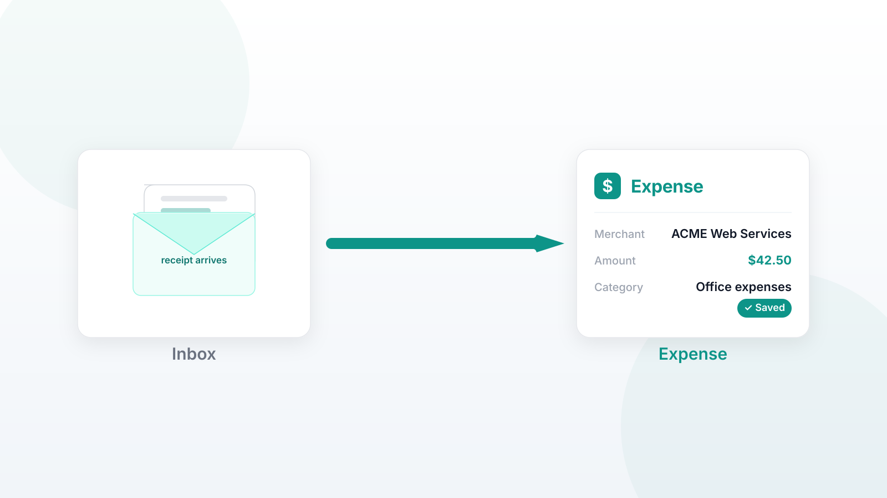

# Connect FastMail: your receipts move from inbox to Expense

_Most expense apps only auto-import receipts from Gmail accounts. [Expense](https://expense.labnotes.org) now works with FastMail — this is how it works, what it gets right, and what it lacks._

I built Expense for people who file taxes as individuals — freelancers, self-employed, side hustlers. The pain point is always the same: receipts arrive by email, and they need to end up in a spreadsheet, categorized, ready for tax season. Up to now, Expense could only pull them in if you forwarded each one to a dedicated address. This worked, but it was an extra step in between "the receipt arrives" and "the expense is entered."

So Expense now connects with your FastMail account directly. Link your inbox once, and all receipts that land in your inbox become expenses, automatically — merchant, amount, and category filled in, dated by when the email arrived. No forwarding, no entering data manually.

## How to connect

1. In FastMail, go to Settings → Privacy & Security → API tokens and create a token with Mail access.
2. In Expense, go to the Email page and paste the token in there.

That's it. There's no "send verification" dance: the token authenticates you as the owner of your inbox, which is stronger proof than clicking a link — you are authorized during the process of linking your account.

If you've received months worth of receipts in your inbox, you will go through all of them in the review screen — process or ignore each one, with the receipt right in front of you. All further emails are processed automatically.

You can unlink your mailbox anytime, and you should also revoke the token in FastMail when you do it. The token is encrypted in the database; it never leaves the app after the linking.

## How we decide an email is an expense

The app processes only emails from senders it knows — either by specific email or by a domain (and subdomain). Such rules are pre-seeded for the major merchants, and you teach other senders (see below).

Even though the email matches the rule doesn't mean that it's an expense. Before doing anything, each email is locally classified as an expense or not: marketing and shipping emails from senders matched by rules are ignored — no expense, no processing fee. Receipts from merchants with which you've already spent are parsed from your history — you know the merchant and category, so you don't need to enter them manually. Emails which we cannot recognize — without an explicit total, refunds, reference-only confirmations — remain in your inbox for a manual adding. Better to leave them there than to process incorrectly.

## Marketing emails don't break it

Newsletter, promotional and shipping notifications from the known senders are never turned into expenses, and they do not hinder the process as well: our pipeline skips the emails that have been already evaluated by the system — a wall of promos will not block newer receipts from being picked up. The inbox full of marketing notifications is a norm, not an exception.

## You teach the app by using it

Forward one receipt from a new sender to receipts@labnotes.org and the app learns this sender — all future receipts from it are processed automatically. It works from any email provider, not only FastMail. In the review screen, you can also process an email and tell the app to remember the sender. Whichever way you choose, one receipt is enough: teach the sender once and the app will keep getting receipts from it from now on.

## We move, not delete emails

Emails we process are moved to the Trash folder, not permanently deleted. If we ever get one wrong, recovering is dragging it out of the Trash. Mistakes never erase the email and never duplicate the expense — each email is evaluated once, and one mailbox can process only one account, so no chance to race for the same receipt. Each expense includes the receipt number from the email, and a confirmation with an edit link arrives back in your inbox.

## Limitations of the system

A few facts that need to be stated. Auto-import is currently only for the FastMail accounts — everyone else forwards the receipts, which works but is not automatic. The pipeline of automatic processing is deliberately local-only — no machine learning model call per receipt — so receipts which require recognition of the text in the image, like PDF attachments, are left in your inbox for manual processing. FastMail API tokens cannot send emails, so we write the confirmation into your inbox, instead of sending an extra email. And if your token stops working, the app flags "needs attention" and does not fail silently.

## Free until we reach 100 users

Expense is free for everyone until the app reaches 100 users. After that, the paid plan becomes available — but it remains free up to 25 invoices a month, so it will cost nothing for many users. (Interesting parallel: the free plan of Expensify stops at 25 SmartScans a month as well.) Now is a good moment to try an expense tracker: sign up while it's free, and receipts will stop becoming a to-do task.

[Create a free account](https://expense.labnotes.org/login?mode=create) and if you use FastMail, connect your mailbox and watch the receipts roll in.
